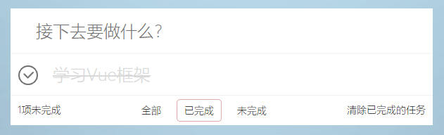

#vue learning
通过vue+webpack打造一个备忘录应用

##项目框架主要搭建流程

#### 1.初始化项目
    npm init
生成package.json文件
#### 2.安装基本包
    npm i webpack vue vue-loader
生成node-modules文件夹和packages-lock.json文件

#### 3.创建src文件夹在根目录下
> src
> >app.vue（顶层vue组件）
> 
> >main.js(入口文件)
#### 4.创建webpack.config.js文件
用于打包前端资源的配置文件
#### 5.在package.json文件的scripts对象中加入"build"配置
    "build":"webpack --config webpack.config.js"
表示调用项目中的webpack,而非全局的webpack。
#### 6.生成打包文件
    npm run build
#### 7.安装相关包或插件用于生成可运行的html
    npm i cross-env html-webpack-plugin webpack-dev-server
#### 8.在pack.json中更改"build"配置并添加"dev"配置
    "build": "cross-env NODE_ENV=production webpack --config webpack.config.js",
    "dev": "cross-env NODE_ENV=development webpack-dev-server --config webpack.config.js"
#### 9.在webpack.config.js中添加相关插件并设置项目访问地址
    const HTMLPlugin=require('html-webpack-plugin')   //生成html页面的插件
    if(isDev){
    // 方便代码调试
    config.devtool='#cheap-module-eval-source-map'
    //服务访问地址
    config.devServer={
        port:8091,
        // host:'localhost',
        overlay:{
            errors:true, //定位错误
        },
        // open:true  //自动在浏览器中打开
        hot: true  //实现热加载，代码更改后实现页面的局部更新
    }
    config.plugins.push(
        new webpack.HotModuleReplacementPlugin(),
        new webpack.NoEmitOnErrorsPlugin()      
    )
    }
#### 10.运行项目
    npm run dev
针对不同的项目之后还要创建不同的vue组件，按需安装各种包或插件
****
本项目结合vue+webpack构建一个todo应用，实现计划定制、和任务的删除和查看等功能。该用例大致分为5部分，分别为：header、footer、todo、item和tabs，即意味着有5个组件。
创建本项目需要安装的一些插件有：

    postcss-loader,autoprefixer,babel-loader,babel-core,babel-preset-env,babel-plugin-transform-vue-jsx

界面运行效果如下：

主界面：

全部计划：

已完成计划：

未完成计划：

